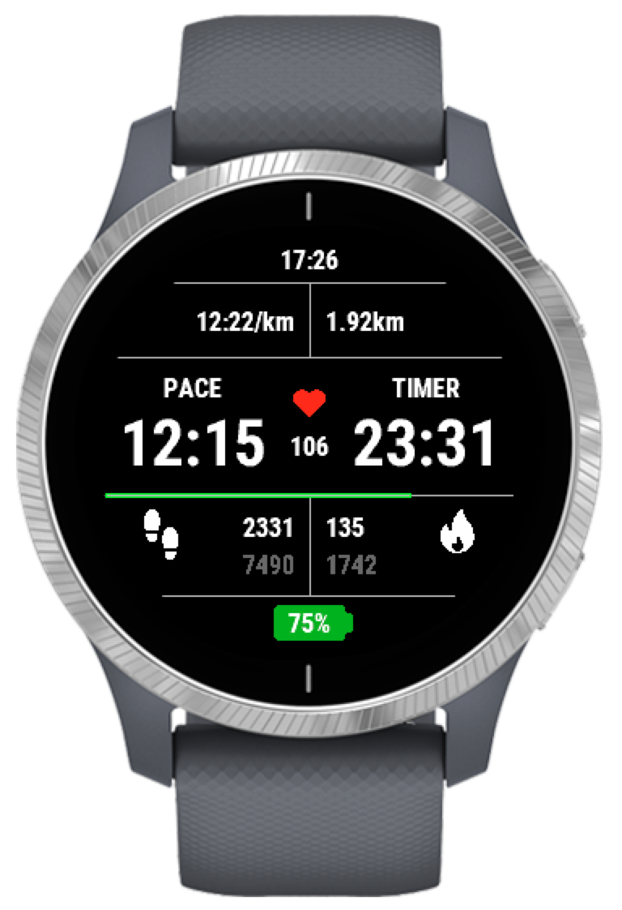
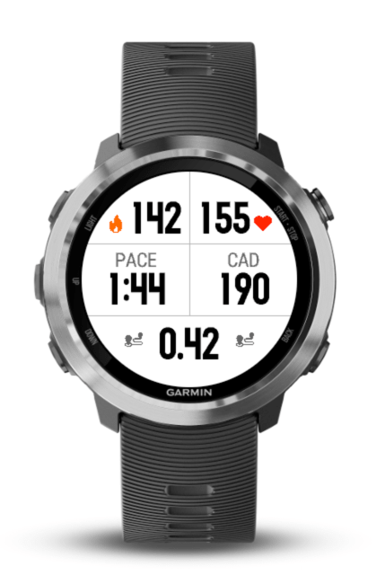
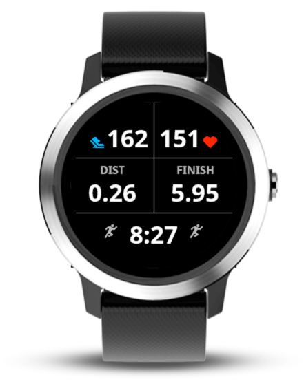
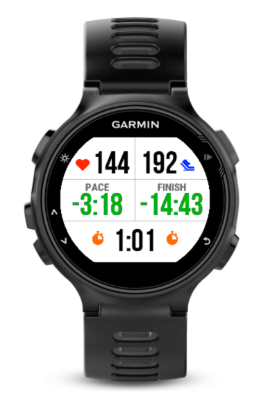
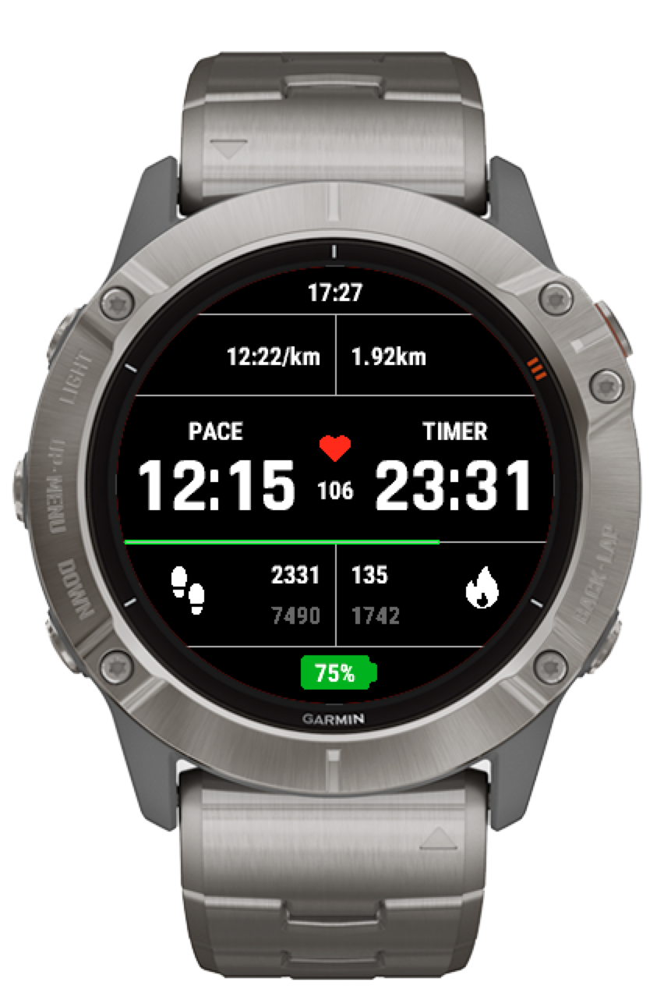

# Walker

## Table of Contents
- [Donate](#donate)
- [Features](#features)
- [Screenshots](#screenshots)
- [FAQ](#faq)
- [Help Requests](#help)
- [Installation](#installation)
- [Contact](#contact)
- [Supported Devices](#devices)
- [Supported Languages](#languages)
- [Source](#source)
- [Credits](#credits)
- [Changelog](#changelog)

## Donate
Donations are welcome and appreciated, but not required. If you'd like to show your appreciation for this app and keep me motivated to maintain it, please feel free to send a small donation to [https://paypal.me/wwarby](https://paypal.me/wwarby). Walker will always remain free and open source.

## Features
A free data field for Garmin watches to provide stats for walking activities. Built to provide more data in a more compact format than is typically available on data fields designed for runners (where too much information becomes impossible to digest at speed). Focused on data relevant to casual walking scenarios where step count, distance, pace and calorie burn are the predominant concerns rather than hiking where bearing, ascent and altitude etc. are more relevant. Currently displays:

- Clock time
- Average pace or speed for the current activity (controlled by settings)
- Total distance for the current activity
- Current pace or speed (or rolling 5/10/30/60 second average by changing settings) *
- Total time for current activity
- Current heart rate (or rolling 5/10/30/60 second average by changing settings) *
- Current heart rate zone and heart icon coloured by zone (if enabled in settings - disabled by default)
- Steps for the current activity
- Steps for today
- Calories for current activity
- Calories for today
- Battery charge level with colour changing battery icon
- Progress bar showing progress towards step goal (if step goal is set)
- Black or white background (via app setting or watch setting)

*Note: 10, 30 and 60 second modes disabled on some older devices due to memory constraints*

Walker also contributes step data to the FIT profile for your activity, showing total steps, lap steps and average steps per km/mile/hour in the activity summary in Garmin Connect. It is aware of and supports device settings for distance units (KM or miles), background colours (black or white), and 12/24 hour clock mode. Feature suggestions are welcome and will be considered.

## Screenshots

	
	
	
	
	

## FAQ
- **How do I install Walker on my Watch?**
	- See the [installation guide](#installation)
- **I've installed Walker on my watch but I can't find it. Where is it?**
	- Walker is a **DataField**, not an _app_. It does not appear as an app and it is not a new _activity_, but rather it is a _presentation_ of data that can be added to any built-in activity on your watch. When you start any activity on your watch, during that acitivity you see one or more data _screens_, each of which has a _layout_ comprised of one or more _fields_. Walker has to be configured on a _screen_ for your chosen activity (which will be _Walk_ unless you have an older watch model that doesn't have the _Walk_ activity, in which case you'll probably want to use the _Other_ activity). It needs to be in a layout with just one field that takes up the whole screen, and you need to set this up manually in the activity settings on your watch. See the [installation guide](#installation).
- **I read the installation guide and on this page and I still can't figure out how to install it. Can you help?**
	- If you think there is a mistake in the installation guide, please feel free to [get in touch](#contact). However, please be aware that I have no affiliation with Garmin and cannot provide technical support on their behalf, nor do I have knowledge of how every model of Garmin watch works or the free time to answer general technical support questions about how to use Garmin watches. If you are having difficulty installing apps on your watch, please get in touch with Garmin technical support. 
- **My watch is set to KM units but Walker is showing miles (or vice versa)**
	- Garmin's settings for units are confusing. There's a single setting in the Garmin Connect app for units with the options "Metric" or "Statute", which sets up a default baseline for the units settings on the watch, but some of the watch models have more granular units settings on the watch settings themselves, with separate settings for *Distance Units* and *Pace Units*. These settings override the defaults set in the app, if set. Walker uses these settings (there really isn't any choice in the ConnectIQ SDK) - it will use the *Distance Units* setting for total distance and the the *Pace Units* setting for speed and pace. Please check that both of these settings have been set to either KM or Miles - otherwise you might see pace in KM and distance in miles or the other way around.
- **How do I apply the black background seen in the screenshots?**
	- There are two ways. First and easiest, the app has checkbox setting named "Black" - if you check this box, Walker will always render with a black background. If you **don't** check this box, then Walker will respect the _Background Color_ setting on the watch itself. For most watches, it's in the activity settings, so assuming you've installed Walker as a data screen for the _Walk_ activity, the steps to change it are as follows (steps for a fenix 5x watch - procedure may vary slightly for other models):
		1. Starting from the watch face, press the top right button. That should display the list of available activities.
		2. Use the bottom left button to scroll down until "Walk" is highlighted in bold.
		3. Press and hold the middle left button. You should see a menu with "Walk Settings" highlighted.
		4. Press the top right button to enter the "Walk Settings" menu. You should then be in a sub-menu with "Data Screens" highlighted.
		5. Use the bottom left button to scroll down until "Background Color" is highlighted in bold.
		6. Press the to right botton to enter the "Background Color" menu. You should then be in a sub-menu with "White" highlighted.
		7. Use the bottom left button to scroll down until "Black" is highlighted in bold.
		8. Press the top right button. This should take you back to the previous menu.
		9. Now press the bottom right button to exit out of the settings menu.
	- Some older watches such as the Forerunner 235 don't have a per-activity setting for background colour. In this case, just use the app setting which you can change in the Garmin ConnectIQ app on your phone.
- **Why isn't the latest version updating on my watch or showing as available in the Connect IQ app?**
	- The Garmin ConnectIQ app doesn't immediately update every user's device when a new version is released. This is probably deliberate to protect Garmin's servers from a surge in traffic when a popular app is updated. Please be patient, updates usually trickle through in a few hours.
- **The translation to my language isn't quite right**
	- The translations are based on Reverso and Google Translate. I've made an effort to find the correct translations but have no easy way of finding out if they are correct except through user feedback. Please get in touch if you're willing and able to provide an accurate translation into your preferred language.
- **Walker isn't translated to my native language**
	- Garmin supports a fixed number of languages on each device, and as far as I'm aware they do not add new languages to existing devices retrospectively, although they do tend to expand the list of supported languages on new devices. I can only offer translations in the languages supported by Garmin for a given device. If you are sure that Garmin supports a language on your device (in other words you can change the language setting on the watch to that language) and I haven't added a translation for that language, please [get in touch](#contact). I'll do the translation using Google Translate, but if you'd like to help by providing an accurate translation into your language I can give you a template in English for conversion.
- **I have a feature suggestion**
	- By all means [get in touch](#contact). Please bear in mind though that Walker has a defined purpose - it is for *casual* walking. I am not inclined to add data that is of more interest to technical hikers, such as altitude, ascent, bearing, cadence etc.
- **It doesn't work on vivoactive**
	- I've had several reports from users that can't find or can't load Walker on a vivoactive 3/4 watch model. I have reports from users of both models confirming that it does install on both models, but that the installation process is different from some of the other models. See these [installation steps](#othermodels) for guidance on installation provided by users who have Walker installed and working on these models.
- **My watch isn't supported**
	- Please first [check the supported devices list](#devices). If your watch is listed there, it *is* supported. A common reason why you might not be able to install Walker on your watch is that the firmware on your watch is out of date. In this case, update the firmware on your watch first and if you don't know how to do that, get in touch with Garmin technical support. If your watch is a newer model it is likely I just haven't gotten around to supporting it yet. Please [get in touch](#contact) and give me a nudge to add support.
- **I think I've found a bug**
	- It's possible. Please check that the issue you've found isn't covered in this FAQ, and make sure you are running the latest version of Walker. It's impossible to tell from looking at the watch itself if you're running the latest version, so you'll need to use the Connect IQ app on your phone, make sure there are no updates showing as available, and sync your device to your phone. If you're confident the issue you're experiencing is not covered in this not covered in this FAQ and you're running the latest version of Walker, please [get in touch](#contact).
- **Can I contribute to the project?**
	- It depends what you want to contribute. I'm not opposed in principle to collaboration but the changes would have to be aligned with my intentions for the design and purpose of Walker (i.e. not a feature I don't want the app to have). It would also have to not break support for older devices currently supported (most notably it would have to keep memory usage below 16KB on older devices). I'd suggest [getting in touch](#contact) if this is something you're interested in.
- **Can I make a forked version of Walker and upload it to the ConnectIQ store?**
	- Yes. Walker is open source and I support the principles of open source software development. The only thing I'd ask as is that you keep your project open source and as a courtesy, don't brand your work as a new and improved version of mine by calling it *Walker 2* or *Walker Pro* or something.

## Help Requests
Since Walker was released I have consistently received 10-20 emails a week about the app, almost all of which are about difficulties with installation. I created Walker for my own personal use and decided to share it for free in the hope that other Garmin fans would find it useful. Whilst I am very glad that it has become popular, I simply do not have the time to respond to the same questions over and over, week after week. In an effort to reduce the volume of these emails I wrote [this installation guide](#installation) and [FAQ](#faq) but it has barely made a dent in the volume of requests, so regretably I have now set up an email filter to delete all emails about Walker that mention installation.

Garmin watches are functionally superb, but the installation procedure for Data Fields in particular (which Walker is) leaves a lot to be desired. The installation process is different for each model, and I cannot reasonably learn and document the installation procedure for watch models I do not own. If these instructions do not work for you, please get in touch with Garmin technical support. Walker *is* compatible with the watch models I have listed compatibility for - I have confirmed this through many interactions with users. If you are struggling with installation, please first read the [installation guide](#installation) below, which will probably resolve your issue. If it doesn't, you will need to get in touch with Garmin technical support.

## Installation
Installation and setup of data fields on Garmin watches is not as straightforward as one might hope, and unfortunately is not the same on every model. The following step-by-step instructions are based on the fenix 5X model and should be broadly applicable to most Garmin watches, but steps or button layout may vary by watch model.
1. Go to the [download page](https://apps.garmin.com/en-US/apps/6cfd1ea6-e841-4c6a-98d2-b87a0b68ee74) in the Connect IQ store in a web browser and (after logging in with your Garmin account) press the "Download" button.
	- You will be asked which device you want to install to.
	- Select the device from the dropdown list and press "Confirm Device".
2. Alternatively, search for "Walker" in the Garmin **ConnectIQ** app on your phone, select Walker by wwarby from the search results and press "Install".
3. Sync your device using the Garmin **Connect** app
4. Once the sync is complete, the Walker Data Field is installed on your phone, but you must also assign it to the sporting activities on which you want to use it.
	- Typically with will be for the "Walk" activity so the instructions that follow are for the "Walk" activity, but you may also want to repeat these steps for "Hike", "Treadmill" etc. or for older watch models that don't have the "Walk" activity you might want to use the activity type "Other".
5. Starting from the watch face, press the top right button. That should display the list of available activities.
6. Use the bottom left button to scroll down until "Walk" is highlighted in bold.
7. Press and hold the middle left button. You should see a menu with "Walk Settings" highlighted.
8. Press the top right button to enter the "Walk Settings" menu. You should then be in a sub-menu with "Data Screens" highlighted.
9. Press the top right button to enter the "Data Screens" menu. You should now see a data screen with a pencil icon in the top right.
10. At this point you can scroll up and down through the data screens you already have configured for Walk activities using the middle left and bottom left buttons. Scroll down to the end of the list using the bottom left button and you should see a screen with a big green + and the words "Add New"
11. Press the top right button to add a new Data Screen. You should land in a menu with "Custom Data" highlighted.
12. Press the top right button. You should be asked to "Choose Layout", where you’ll be able to scroll up and down through different layouts. You want the top one, which just has "Field 1" in the middle.
13. Press the top right button to move to choosing the field. You should land in a menu with Connect IQ Fields highlighted and 0/2 Added underneath.
14. Press the top right button. You should land in another sub-menu, where you’ll be able to select the downloaded data field you want to use.
15. Scroll down using the bottom left button until "Walker" is selected, then press the top right button to select it.
16. You should now see the Walker data field on your screen, but it will be the last data field in the list. You probably want it to be the first so that it shows by default when you start a walk.
18. Press the top right button to edit the position of the field. You should land in a menu with "Layout 1 Field" highlighted. Use the bottom left button to scroll down to "Reorder"
19. Press the top right button. You should now land in a sub-menu where "Walker" is highlighted.
20. Press the middle left button repeatedly to move Walker up to the top of the list, then press the top right button to confirm.
21. You’re done. Press the bottom right button three times to exit out of the menus, and you should be back to the activity selection menu with "Walk" selected.
22. Press the top right button to select the "Walk" activity and you should find you’re ready to go for a walk with Walker shown on screen by default.

### Other models
The following installation steps for other watch models were kindly provided by a users of Walker. I have no way to independently verify these installation instructions since the Garmin simulator does not provide simulation of the installation experience, but I have every confidence that these instructions are accurate and succeeded for the users who provided them. Thanks to Tom and Gary for taking the time to provide this information.

#### vivoactive 3
1. Starting from the watch face, press the button (Key). That should display the list of available activities.
2. Scroll to the "Walk" activity and tap the screen to select.
3. Tap "Settings".
4. Tap "Data Screens".
5. Tap "Layout"  and scroll to the "1-Field" layout and tap the screen select.
6. Scroll to "Screen 1" and tap to select.
7. Tap "Edit Data Fields".
8. Tap the screen which should show the default/existing Data Field.
9. In the list of Data Fields scroll and tap to select "Connect IQ 0/2 Added".
10 Tap to select "Walker".
11. The Walker Data Field should now show as your default screen.

#### vivoactive 4
1. Select activity list.
2. Long press bottom button.
3. Select "Manage apps".
4. Select "Walk".
5. Select "Walk settings".
6. Select "Data Screens".
7. Select "Screen 1".
8. Select "Layout".
9. Use finger to scroll up / down until a screen with 1 data field presents itself.
10. Use finger to touch screen to confirm 1 data field.
11. Select "Edit Data Fields".
12. Use finger to touch screen to choose data field.
13. Select "Connect Fields".
14. Select "Walker".

## Contact
Please use [this link](https://apps.garmin.com/en-US/apps/6cfd1ea6-e841-4c6a-98d2-b87a0b68ee74/contactdeveloper) to get in touch with me directly through the ConnectIQ store. If you need to get in touch this way, **please write in English**. I have translated the app into many languages using online translation tools, but I only understand English and I am less likely to read your message if I have to copy it into an online translator first.

## Supported Devices
- Approach S60 / S62 / S70 42mm / S70 47mm / S70 51mm
- Captain Marvel / Darth Vader / First Avenger / Rey
- D2 Bravo / Bravo Titanium / Charlie / Delta / Delta PX / Delta S / Air / Air X10 / Mach 1
- Descent Mk1 / Mk2 / Mk2S
- epix 2 / 2 Pro 42mm / 2 Pro 47mm / 2 Pro 51mm
- Enduro
- fenix 3 / 3 HR / 5 / 5 Plus / 5S / 5X / 5X Plus / 6 / 6 Pro / 6S / 6S Pro / 6X Pro / 7 / 7 Pro / 7S / 7S Pro / 7X / 7X Pro / Chronos
- Forerunner 230 / 235 / 245 / 245 Music / 255 / 255S / 255 Music / 255S Music / 265 / 265S / 630 / 645 / 645 Music / 735xt / 935 / 945 / 945LTE / 955 / 965
- MARQ Adventurer / Athlete / Aviator / Captain / Commander / Driver / Expedition / Golfer / 2
- Venu / 2 / 2S / 2 Plus / 3 / 3S / Square / Square 2 / Square 2 Music
- vivoactive 3 / 3 Music / 3 Music LTE / 4 / 4S / 5

*Note: Only tested in on a real epix 2, fenix 5X and Forerunner 235 in the field, all other watches tested only in the SDK device simulator.*

## Supported Languages

Walker (watch face text and settings) is currently translated into the following languages, which at the time of writing is every language supported by the Garmin SDK:

- Arabic
- Bulgarian
- Chinese (Simplified)
- Chinese (Traditional)
- Croatian
- Czech
- Danish
- Dutch
- English
- Estonian
- Finnish
- French
- German
- Greek
- Hebrew
- Hungarian
- Indonesian
- Italian
- Japanese
- Korean
- Latvian
- Lithuanian
- Malay
- Norwegian
- Polish
- Portuguese
- Romanian
- Russian
- Slovak
- Slovenian
- Spanish
- Swedish
- Thai
- Turkish
- Vietnamese

### Note on language support in the Garmin simulator
Arabic, Hebrew and Thai supported by the Garmin ConnectIQ SDK but are not rendered correctly in the device simulator. The simulator also seems to throw an exception when a Thai string resource is used for the units of a FIT contribution. I have tested Arabic and Hebrew on a real fenix 5x watch and it seems to work fine, but my watch doesn't support Thai. Due to these issues it is impossible for me to thoroughly test these languages on all devices.

### Translation help
Help with internationalisation is appreciated. Current translations are based on Reverso and Google Translate. I've made an effort to find the correct translations but have no easy way of finding out if they are correct except through user feedback.

## Source
Walker is open source (MIT license) and it's code resides on GitHub at [https://github.com/wwarby/walker](https://github.com/wwarby/walker)

## Credits
Code and ideas borrowed from [RunnersField by kpaumann](https://github.com/kopa/RunnersField) and [steps2fit by rgergely](https://github.com/rgergely/steps2fit). Thanks for open sourcing your projects.

### Icon Credits
- Icons by [Freepic](https://www.flaticon.com/authors/freepik) from [www.flaticon.com](https://www.flaticon.com)
- Flame icon by [Those Icons](https://www.flaticon.com/authors/those-icons) from [www.flaticon.com](https://www.flaticon.com/free-icon/fire_483675)

## Changelog
- 1.6.1
    - Fix a bug introduced by changes in 1.6.0
- 1.6.0
    - Add support for new devices, update translations
- 1.5.1
    - Add translation capability for speed / pace units with Hebrew translation included
- 1.5.0
    - Add support for D2 Mach 1, Forerunner 55, 255, 255S and 955
		- Internal work to lock code for older lower memory devices such as Forerunner 235, enabling future new feature development for newer devices
		- Fix a longstanding bug where steps would go screwy after using "resume later" on an activity
		- Fix Hungarian and Hebrew translations - thanks (thanks [flocsy](https://github.com/flocsy))
		- Use camelCase English names for custom FIT contribution field names
- 1.4.0
    - Add support for new devices
- 1.3.1
    - Add support for new devices, update Chinese translation (thanks [Chuanyi](https://github.com/Likenttt))
- 1.3.0
    - Add support for Venu 2 and Venu 2S
- 1.2.0
    - Add support for new devices
- 1.1.2
    - Update Polish translation
- 1.1.1
    - Fix bug with reducing font size on walks over 1 hour
- 1.1.0
	- Setting for black background
	- Memory optimisation
- 1.0.8
	- Fix calculation bug when speed display mode was selected in combination with miles units
- 1.0.7
	- Black battery percentage text colour when battery is yellow (10-20%)
- 1.0.6
	- Add "English" as a language in addition to it being the "Default" language
- 1.0.5
	- Removed "BETA" from the app name
- 1.0.4
	- Fixed where I accidentally left screenshot hard-coded values in the build
- 1.0.3
	- Increase font sizes for Forerunner 230, 235, 630 and 735XT
- 1.0.2
	- Fix calculation bug when speed display mode was selected
- 1.0.1
	- Add Arabic, Hebrew and Thai language translations
- 1.0.0
	- Add FIT contributions for average steps per km/mile/hour
	- Smaller heart icon when HRZ is disabled
	- Show + or - if HR is outside HR zones
	- Memory optimisation
	- Add language support for all remaining languages supported by Garmin
- 0.6.3
	- Fix bug where incorrect heart rate zone was shown
  - Fix bug where speed was calculated incorrectly if units were set to miles and speed display was enabled in settings
	- Fix bug where pace units setting on watch was ignored (distance units was being used for pace)
- 0.6.2
	- Fix bug with duplicate label in settings
- 0.6.1
	- Accurate French and Russian translations
- 0.6.0
	- Fix missing settings
	- Add setting to show speed instead of pace
	- Added support for several new languages
- 0.5.0
	- Use larger fonts where possible on all devices
	- Make daily steps and calories text darker on white backgrounds
	- Add support for new watch models
- 0.4.1
	- Fix battery icon position bug on 240x240px screens
- 0.4.0
	- Add heart rate zone (configured by setting, disabled by default) to heart icon
	- Colour heart icon by heart rate zone
- 0.3.0
	- Add FIT contribution for steps
	- Support for "resume later" on activities
	- Localised language support for several European languages
	- Fix bug that would reset activity steps on activity "stop" (as opposed to "reset")
	- Memory usage optimisation
- 0.2.0
	- Add step goal progress bar
	- Hopefully support stable transition across midnight boundary for step counter
	- Optimised images for compression efficiency
	- Screenshots for Garmin Store
- 0.1.0
	- Initial alpha release
